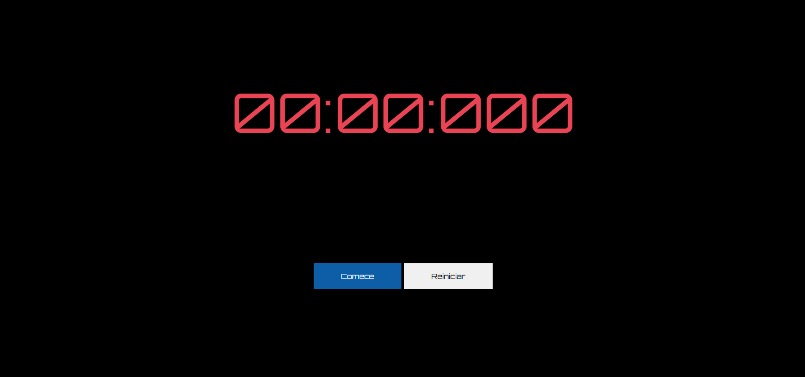

# Cronômetro Online

## Esse é um projeto feito com o intuito de botar em prática habilidades em JavaScript, usando o DOM, setInterval e clearInterval.

## Imagens

## 🛠 Habilidades
As seguintes tecnologias foram usadas na construção do projeto:

- HTML5
- CSS3
- JavaScript

## 🌱 Aprendizados

Utilização do DOM (Document Object Model) para modificar e selecionar os elementos do HTML no JavaScript, e usar os métodos do setInterval e clearInterval, para o funcionamento correto do cronômetro.

## 🔗 Entre em contato
